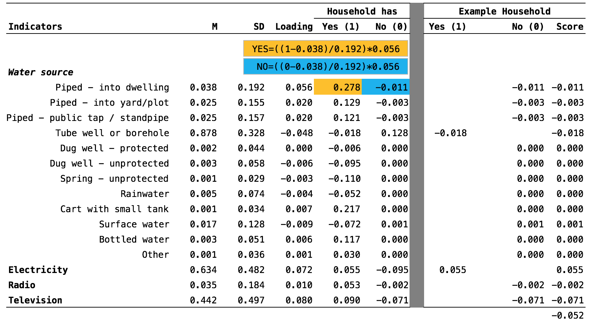

--- 
knit: "bookdown::preview_chapter"
---

# Measurement {#indicators}

A good theory of change or logic model, the subject of the last chapter, can serve as a bridge to good measurement. This chapter describes key measurement concepts, such as how to identify study constructs and select or construct indicators of these constructs.

## Terminology

Regardless of the research design used, if the goal is to estimate the impact of a program/intervention/treatment/policy on **[blank]**, then **[blank]** is the outcome. But what is the difference between an outcome and an indicator? Between an indicator and an instrument? @glennerster:2013 provide helpful definitions of the terms most often used in discussions of measurement and data collection, which is expanded in the table below.

<br>
```{r terms, echo=F}
terms <- data.frame(v1=c(
  "**Construct**",
  "**Outcome**",      
  "**Indicator**", 
  "**Instrument**",
  "**Variable**",
  "**Respondent**"
),
v2=c(
  "A characteristic, behavior, or phenomenon to be assessed and studied. Often cannot be measured directly.",
  "In an impact evaluation, 'constructs' will be referred to as outcomes—the intended results of the program. Also referred to as an endpoint in a trial.",
  "Observable measures of outcomes or other study constructs.",
  "The tools used to measure indicators. Also referred to as a measure.",
  "The numeric values of the indicators.",
  "The person (or group) that we measure."
     ),
v3=c(
  "Depression",
  "Decreased depression",
  "Depression severity score on a depression scale",
  "A depression scale, made up of questions/items about symtoms of depression",
  "",
  ""
))
names(terms) <- c("Term", "Definition", "Example")

knitr::kable(terms, format = "html") %>%
  html_table_width(c(100,350,150))
```
<br>

For example, @patel:2016 designed a randomized controlled trial (RCT) in India to test the efficacy of a [lay counsellor-delivered brief psychological treatment](https://www.ted.com/talks/vikram_patel_mental_health_for_all_by_involving_all) for severe depression. The hypothesized outcome was a reduction in severe depression. In a theory of change or logic model, outcomes take on the language of change: increases and decreases.

<br>
```{r patel, echo=F}
knitr::include_url("https://www.npr.org/player/embed/505733704/505811951",
                   height="250px")
```
<br>

But the word "outcome" is also used more generally and synonymously with "indicator," particularly in articles reporting study results. For example, @patel:2016 write:

> Primary outcomes were depression symptom severity on the Beck Depression Inventory version II and remission from depression (PHQ-9 [Patient Health Questionnaire] score of <10) at 3 months in the intention-to-treat population, assessed by masked field researchers.

Using the language above, the primary **outcome** was severe depression and the team measured two **indicators** of severe depression: (1) a depression symptom severity score on the Beck Depression Inventory version II (BDI-II) and (2) a score of less than 10 on the PHQ-9. They used two **instruments** to measure depression: the PHQ-9 ([pdf](http://www.phqscreeners.com/sites/g/files/g10016261/f/201412/PHQ-9_English.pdf)) and the [BDI-II](https://en.wikipedia.org/wiki/Beck_Depression_Inventory).

Outside of the impact evaluation literature, the word "outcome" is often replaced with "dependent variable" or "response variable." Additional constructs of interest might be called "covariates," "independent variables," or "exposure variables."

To simplify matters, the following questions are useful when planning a study:

1. What is the key construct under study? What other constructs need to be measured at the same time to fully understand the key construct?
2. What are the indicators for these constructs? In other words, how can these constructs be quantified?
3. What measurement instrument will enumerate these quantities? What type of data will this instrument yield? (This is the topic of the next chapter.)

Fundamentally, there must be a logical flow from the research problem to the measurement of primary study outcomes/constructs. Figure \@ref(fig:flow) demonstrates this idea using @patel:2016 as an example.

```{r flow, fig.cap="From research problem to study instruments", echo=F}
knitr::include_graphics("images/flow.png", dpi = NA)
```

```{block, type='rmdpuzzle'}
The language of qualitative studies is a bit different. These studies emphasize study constructs, but not indicators or measures. Quantification is not the goal.
```

## Identify Constructs

Most studies are designed to provide the best evidence possible about one or two **primary outcomes** linked directly to the main study objective. **Secondary outcomes** may be registered, investigated, and reported as well, but these analyses may be more exploratory in nature if the study design is not ideal for measuring these additional outcomes.

For instance, @patel:2016 included the following secondary outcomes in addition to depression severity and remission from depression:

> Secondary outcomes were disability on the WHO Disability Assessment Schedule II and total days unable to work in the previous month, behavioural activation on the five-item abbreviated Activation Scale based on the Behavioural Activation for Depression Scale-Short Form, suicidal thoughts or attempts in the past 3 months, intimate partner violence (not a prespecified hypothesis), and resource use and costs of illness estimated from the Client Service Receipt Inventory.

These outcomes were labeled secondary because the study was powered on the primary outcomes (a topic of a later chapter):

> ...we aimed to recruit 500 participants to detect the hypothesised effects (a standardised mean difference of 0·42), with 90% power for the primary continuous outcome of depression severity and 92% power to detect a recovery of 65% in the HAP group for our primary binary outcome of depression remission.

The basic idea is that one study cannot definitively answer every possible research question. There are tradeoffs in terms of the time, money, and resources, so investigators must  prioritize among all possible outcomes.

The basic idea is that one study cannot definitively answer every possible research question. There are tradeoffs in terms of the time, money, and resources, and investigators must prioritize among all possible outcomes.  

## Select Good Indicators

To define a study construct in terms of an indicator and to specify its measurement is to **operationalize** the construct. Indicators should be DREAMY™:

----------------  --------------------------
**D**efined       clearly specified
**R**elevant      related to the construct
**E**xpedient     feasible to obtain
**A**ccurate      valid measure of construct
**M**easurable    able to be quantified
customar**Y**     recognized standard
----------------  --------------------------

### **D**EFINED

It is important to clearly specify and define all study variables, especially the indicators of primary outcomes. This is a basic requirement that enables a reader to critically appraise the work, and it serves as a building block for future replication attempts. 

For instance, the construct of interest in @patel:2016 was severe depression, and the two indicators were (a) depression symptom severity and (b) remission from depression. The authors [preregistered the trial](https://www.isrctn.com/ISRCTN95149997?q=ISRCTN95149997&filters=&sort=&offset=1&totalResults=1&page=1&pageSize=10&searchType=basic-search) and defined these outcomes as follows:

1. Mean difference in total score measured at 3 months by the Beck's Depression Inventory (BDI-II), a 21-item questionnaire assessment of depressive symptoms. Each item is scored on a Likert scale of 0 to 3. It measures depression severity based on symptom scores.

2. Remission, defined as a score of <10 measured at 3 months by the Patient Health Questionnaire (PHQ-9), a nine-item questionnaire for the detection and diagnosis of depression based on DSM-IV criteria. It is scored on a scale of 0 to 3 based on frequency of symptoms.

### **R**ELEVANT

Indicators should be relevant to the construct of interest. In @patel:2016, scores on the BDI-II and PHQ-9 are clearly measures of depression severity and remission. An example of a nonrelevant indicator would be scores on the [Beck Anxiety Inventory](https://en.wikipedia.org/wiki/Beck_Anxiety_Inventory), a separate measure of anxiety. While anxiety and depression are often comorbid, anxiety is a distinct construct.

### **E**XPEDIENT

It should be feasible to collect data on the indicator given a specific set of resource constraints. Asking participants to complete a 21-item questionnaire and a 9-item questionnaire (as in @patel:2016) does not represent a large burden on study staff or participants. However, collecting and analyzing biological samples (e.g., hair, saliva, or blood) might.

### **A**CCURATE

Accurate is another word for "valid." Indicators must be valid measures of study constructs. In other words, do scores on the BDI-II and PHQ-9 measure a concept called depression?

### **M**EASUREABLE

Indicators must be quantifiable. Psychological constructs like depression are often measured using scales like the BDI-II and the PHQ-9. Other constructs require more creativity. For instance, @olken:2005 measured corruption in Indonesia by digging core samples of newly build roads to estimate the amount of materials used in construction and then compared cost estimates against reported expenditures to calculate a measure of corruption (i.e., by determining the missing expenditures).

### CUSTOMAR**Y**

Whenever possible, it is smart to use standard indicators and follow existing definitions and calculation methods. One way to learn about standards and customs is to follow the current literature and locate articles that measure the same constructs. Familiarity with what is being published and the methods being used is a significant advantage in achieving publication of a research study. Following these methods lends instant credibility in the submission evaluation and peer-review process. For example, to successfully publish the results of an impact evaluation of a microfinance program in an economics journal, other current papers by economists in high-impact journals can provide important examples of research and data collection methods. How do they measure outcomes like income, consumption, and wealth? Generally, data collection methods should follow the approaches and use the instruments that have already been established in a research field unless the purpose of the study is to overcome the limitations of the standard methods.

If studying population health, for instance, a good source of customary indicators is the World Health Organization's *Global Reference List* of the 100 core health indicators [@whocore:2015]:

```{r core100, fig.cap="WHO 100 core health indicators. Source: http://bit.ly/1NgGeLh", echo=F}
knitr::include_graphics("images/grl.png", dpi = NA)
```

In addition, the United Nations [Sustainable Development Goals (SDG)](https://sustainabledevelopment.un.org/) provides 230 indicators to measure 169 targets for 17 goals. The SDG indicators are available on a [website](http://unstats.un.org/sdgs/) to assist researchers with their study design.

```{r sgds, fig.cap="Sustainable Development Goals. Source: http://bit.ly/2cuDpWN.", echo=F}
knitr::include_graphics("images/sdgs.png", dpi = NA)
```

## Constructing Indicators

### SINGLE ITEM INDICATORS

Some indicators are measured with responses to a single item (or a short series of items) on a survey. For instance, in Malaria Indicator Surveys, the "[proportion of households with at least one ITN](http://www.rollbackmalaria.org/files/files/resources/tool_HouseholdSurveyIndicatorsForMalariaControl.pdf)" is defined as the "number of households surveyed with at least one ITN" (numerator) divided by the "total number of households surveyed" (denominator).

> The numerator for this indicator is obtained from asking the household respondent if there is any mosquito net in the house that can be used while sleeping and from determining whether each net found in a household is a factory-treated net that does not require any treatment (an LLIN) or a net that has been soaked with insecticide within the past 12 months. The denominator is the total number of surveyed households.

To determine whether a household owns an ITN, survey administrators asked the following sequence of [questions](http://malariasurveys.org/toolkit.cfm).

```{r itnq, echo=F}
itnq <- data.frame(n=c(
  "119",
  "120",
  "121",
  "122",
  "123",
  "124",
  "125"
),
q=c(
"Does your household have any mosquito nets?",
"How many mosquito nets does your household have?",
"ASK THE RESPONDENT TO SHOW YOU ALL THE NETS IN THE HOUSEHOLD",
"How many months ago did your household get the mosquito net?",
"OBSERVE OR ASK BRAND/TYPE OF MOSQUITO NET",
"Since you got the net, was it ever soaked or dipped in a liquid to kill or repel mosquitoes?",
"How many months ago was the net last soaked or dipped?"
)
)
names(itnq) <- c("Number", "Question")

knitr::kable(itnq, format = "html") %>%
  html_table_width(c(50,550))
```

The end result is a binary indicator (yes/no) of whether the household has a bednet that has been dipped in the past 12 months or is factory-treated. In theory, it is possible to ask this in one question—"Does your household have any factory-treated mosquito nets or nets that have been dipped in a liquid to kill or repel mosquitoes in the past 12 months?” But this is a long and complicated question, and it is more effective to break it up into smaller parts.

```{block, type='rmdplay'}
```

```{r itnaccess, echo=F}
knitr::include_url("https://www.youtube.com/embed/YfTXcc13GOI")
```

Sometimes more abstract constructs can be measured with just one survey item. For instance, Konrath et al. [-@konrath:2014] ran 11 studies and found that narcissism can be measured with one question:

> To what extent do you agree with this statement: "I am a narcissist." Response options range from "not very true about me" (1) to "very true of me" (7).[^skeptical]

[^skeptical]: Skeptical? From the authors: "We recognize that some readers may be skeptical about whether simply asking people if they are narcissistic is an appropriate measure of narcissism, given that narcissism is associated with a host of defensive processes. Are people really aware of their own levels of narcissism? We would argue that, based on the evidence from the current studies, people who are willing to admit that they are relatively more narcissistic than others, actually are."

Most often, however, constructs like narcissism and depression are measured with multiple items that are combined into indexes or scales. The terms index and scale are often used interchangeably, but they are not synonymous. While they share in common the fact that multiple items or observations go into their construction, making them **composite measures**, the method for and purpose of combining these items or observations are distinct.

### INDEXES

**Indexes** combine items into an overall composite, often without concern for how the individual items relate to each other. For instance, the [Dow Jones Industrial Average](https://en.wikipedia.org/wiki/Dow_Jones_Industrial_Average) is a stock-market index that represents a scaled average of stock prices of 30 major U.S. companies such as Walt Disney and McDonald's. The Dow Jones is a popular indicator of market strength and is constantly monitored during trading hours. Every index has its quirks, and the Dow Jones is no exception. Companies with larger share prices have more influence on the index.

An index popular in the global health field is the [DHS wealth index](http://www.dhsprogram.com/topics/wealth-index/Wealth-Index-Construction.cfm). As a predictor of many health behaviors and outcomes, economic status is a covariate in high demand. Failing to measure economic status in a household survey would be as grave as failing to note a respondent's gender or age, but measuring economic status is not nearly as easy.[^socioecon]

[^socioecon]: According to -@dhswealth:2004, the wealth index is more appropriately understood as a measure of economic status rather than socioeconomic status because it does not include type of occupation and level of education.

In an ideal data world, every survey would include *accurate* information on household income and consumption as measures of household wealth. Income is volatile, however, and consumption is very hard to measure over short periods. Thus, in the late 1990s, researchers proposed creating an index of household assets as a measure of a household's economic status [@dhswealth:2004].

Data for the wealth index come from DHS surveys conducted in a particular country. Indicator variables include individual and household assets (e.g., phone, television, car), land ownership, and dwelling characteristics, such as water and sanitation facilities, housing materials (i.e., wall, floor, roof), persons sleeping per room, and cooking facilities. The figure below shows a snapshot of the DHS Household Questionnaire.

```{r wealth, fig.cap="DHS Round 7 Household Questionnaire.", echo=F}
knitr::include_graphics("images/wealth.png", dpi = NA)
```

A key decision in creating indexes like the wealth index is *whether to weight* the individual components. Should owning a car be given the same weight as owning a phone? In other words, in constructing an index that measures someone's wealth, should owning a phone contribute as much to the index as owning a car? Most researchers would probably say no, so the next question is *how to assign differential weights* to the components. @filmer:2001 first proposed assigning weights via **[principal component analysis](https://en.wikipedia.org/wiki/Principal_component_analysis)**, or PCA. 

Principal component analysis is a data reduction technique in which indicators are standardized (i.e., transformed into *z*-scores) so that they each have a mean of 0 and a variance of 1. If there are 10 items, the total variance is therefore 10, and there are 10 *principal components.* A principal component (i.e., an eigenvector) is a linear combination of the original indicators; thus, every indicator (e.g., yes/no response to owning a phone) has a loading factor that represents the correlation between the individual indicator and the principal component.

The first principal component always explains the most variance, and in descending order, each component explains a smaller amount of total variance. In constructing the wealth index, the first component measures the concept called "wealth," so the factor loadings on the first principal component are used to create a score for each household. For example, consider the [2014 Bangladesh DHS survey](http://dhsprogram.com/what-we-do/survey/survey-display-461.cfm).

```{r wealthex, fig.cap="Example wealth index construction (abbreviated from 2014 Bangladesh DHS).", echo=F}

```

The factor loading for water piped into a dwelling (i.e., indoor plumbing) was 0.056 in the PCA run on the 2014 Bangladesh DHS data. To create the index, this loading is converted into a score representing whether the household has or does not have the asset, and these indicator scores are summed for an overall index score for each household. Once every household has an index score, every participant is assigned to of 1 of 5 wealth quintiles reflecting their economic status (*relative to the sample*). Hereby, the relationship between health outcomes and wealth can be examined.

### SCALES

In an index, indicators "cause" the concept that is being measured. For example, a household's wealth is determined by the assets it owns (e.g., livestock, floor quality). Conversely, in a **scale**, the concept "causes" the indicators. 

```{r scaleindex, fig.cap="Scale vs index.", echo=F}
knitr::include_graphics("images/scalevsindex.png", dpi = NA)
```

For an example, consider depression. There is no blood test for depression, so depression is a construct or concept that needs a definition. According to the Diagnostic and Statistical Manual for Mental Disorders, currently the DSM-V, the criteria for major depressive disorder are as follows, A-E:

***A. Five (or more) of the following symptoms have been present during the same 2-week period and represent a change from previous functioning; at least one of the symptoms is either (1) depressed mood or (2) loss of interest or pleasure.***

1. Depressed mood most of the day, nearly every day, as indicated by either subjective report (e.g., feels sad, empty, hopeless) or observation made by others (e.g., appears tearful). 
2. Markedly diminished interest or pleasure in all, or almost all, activities most of the day, nearly every day (as indicated by either subjective account or observation.)
3. Significant weight loss when not dieting or weight gain (e.g., a change of more than 5% of body weight in a month), or decrease or increase in appetite nearly every day. 
4. Insomnia or hypersomnia nearly every day.
5. Psychomotor agitation or retardation nearly every day (observable by others, not merely subjective feelings of restlessness or being slowed down).
6. Fatigue or loss of energy nearly every day.
7. Feelings of worthlessness or excessive or inappropriate guilt (which may be delusional) nearly every day (not merely self-reproach or guilt about being sick).
8. Diminished ability to think or concentrate, or indecisiveness, nearly every day (either by subjective account or as observed by others).
9. Recurrent thoughts of death (not just fear of dying), recurrent suicidal ideation without a specific plan, or a suicide attempt or a specific plan for committing suicide.

***B. The symptoms cause clinically significant distress or impairment in social, occupational, or other important areas of functioning.***

***C. The episode is not attributable to the physiological effects of a substance or to another medical
condition.***

***D. The occurrence of the major depressive episode is not better explained by schizoaffective disorder, schizophrenia, schizophreniform disorder, delusional disorder, or other specified and unspecified schizophrenia spectrum and other psychotic disorders.***

***E. There has never been a manic episode or a hypomanic episode.***

If someone meets criteria A–E, they are diagnosed with major depressive disorder (MDD). A diagnosis by a trained mental health professional like a psychiatrist is considered the gold standard measure of depression. Gold standards are in short supply in many places, however, and more feasible methods of measuring this concept called depression are needed. A reasonable alternative is to develop a set of questions (i.e., with answers on scale) that can be administered to measure symptom severity. Presumably, if a person scores high enough on this scale, he or she would be considered "depressed".

In this example, depression is the **latent variable** that cannot be measured directly. To create an indicator of depression, a combination of **manifest variables** that are “caused” by the latent variable depression must be defined.

@patel:2016 used the Beck Depression Inventory [@beck:1996] to measure depression severity. The BDI-II consists of 21 groups of statements, such as

1. **Sadness**
	* (0) I do not feel sad
	* (1) I feel sad much of the time
	* (2) I am sad all the time
	* (3) I am so sad or unhappy that I can't stand it
2. **Pessimism**
	* (0) I am not discouraged about my future
	* (1) I feel more discouraged about my future than I used to be
	* (2) I do not expect things to work out for me
	* (3) I feel my future is hopeless and will only get worse
	
Each item is a manifest variable—something measured directly by asking the question. The latent variable depression is measured indirectly by summing the responses to all 21 manifest variables to create the BDI-II scale score.

#### Determining the factor strucutre of scales {-}

##### Exploratory factor analysis{-}

Typically, when developing a new scale, researchers start with a large pool of potential items, many more than can ever be used an applied context (where administration time is a relevant constraint). They then use exploratory factor analysis or some other method of data reduction to shrink the pool.

[**Exploratory factor analysis**](https://en.wikipedia.org/wiki/Exploratory_factor_analysis) (EFA) looks a lot like PCA, but they are conceptually and computationally distinct. Whereas PCA results in a linear combination of indicators that maximized total variance, factor analysis maximizes the common or shared variance.

Factor analysis helps explain the structure of the data. For instance, the BDI-II consists of 21 items that are designed to measure the latent construct of depression, but many studies have examined whether these items can be grouped into subfactors—different domains of depression.

@manian:2013 administered the BDI-II to 953 new mothers "from a large East coast metropolitan area" and then conducted EFA on data from half of the sample.[^holdout] They looked for 2- to 4-factor solutions and found that a 3-factor model made the most sense empirically (based on data) and theoretically (based on their knowledge of the literature). Their model suggested that the latent variable of depression is composed of three subfactors: cognitive symptoms, affective symptoms, and somatic symptoms.  

[^holdout]: This hold-out approach enables researchers to develop the model using some  existing data and cross validating (i.e., testing) the model on new data not used to build the model. This step is important because the best EFA model, if it is too closely fit to the data, it will not be replicable. In other words, if another study was run to collect new data, the model may not be a good fit to the new data.

##### Confirmatory factor analysis{-}

@manian:2013 then used the holdout data (i.e., data from their sample not used in the EFA) to test the fit of their 3-factor model through [**confirmatory factor analysis**](https://en.wikipedia.org/wiki/Confirmatory_factor_analysis) (CFA). It fit! The model is shown below.

For a project using an existing scale in a new population or setting, CFA is a good technique to determine whether the original factor structure generalizes to the context of the project. Often, the original scale is developed in a high-income setting, and the research might suggest that it makes sense to construct an overall scale score (of some latent variable like depression) *AND* 2 or 3 subscale scores that correspond to subfactors (like cognitive symptoms and affective symptoms). However, in a different cultural context, the construct might not manifest itself along the same dimensions. CFA can be a helpful tool to determine the applicability of the scale in the new context.

```{r factor3, fig.cap="Final 3-factor model of the BDI-II with standardized path coefficients. Source: @manian:2013.", echo=F}
knitr::include_graphics("images/3factor.jpg", dpi = NA)
```

#### Constructing scale scores {-}

When it comes to scales, how to actually construct scale scores is the primary question. Suppose that many items have been proposed to measure a latent construct like depression. The survey with these items has been administered to a few hundred people, and the EFA and CFA analyses have been conducted to determine the factor structure. What happens next?

Several options are available for constructing scale scores. @distefano:2009 classify them in two ways: refined and nonrefined. 

1. **Non-refined methods** are most commonly used because they are simple to compute and easy to compare across samples.
	* **Sum raw scores.** If there are 21 items, each with a possible range of 0 to 3, the scores are simply summed for each item. This method is used in the BDI-II, which has a possible range of scores from 0 to 63.
	* **Average raw scores.** This method uses the same idea as summing, but averaging keeps the possible range consistent with the response scale. For instance, if 21 items with response options ranging from 0 to 3 are averaged, the scale scores will also range from 0 to 3. This method makes intuitive sense when interpreting results.
	* **Sum standardized scores.** With this method, each item is first standardized to have the same mean and standard deviation. This is often a good option when the standard deviations of the items vary quite a bit. 
2. **Refined methods** may produce more exact scores because items are weighted empirically (as opposed to equal weighting in nonrefined methods), and relationships between factors are reflected in the scoring. But refined methods are more complex and require the analyst to make a number of decisions along the way that can  lead to very different results. 

### EVALUATING PSYCHOMETRICS

To evaluate scales like the BDI-II, several **psychometric** properties are often considered that can be grouped generally into two buckets: reliability and validity. The following  example highlights the basic difference between these terms.

Imagine a bathroom scale and a person who weighs 195 lbs. If he steps on, then off, then on again, and the scale reads 210 lbs and then 180 lbs, he would realize that he is the owner of an *unreliable* scale. So he purchases a new scale. He steps on and off the new scale, and it reads 400.12 lbs the first time then 400.15 lbs the second time. It is very reliable (i.e., has *good precision*), but unfortunately its measurement was very wrong (i.e., *poor accuracy*, *invalid*) because he actually weighs 195 lbs.

#### Reliability{-} 

A **reliable** instrument is a consistent instrument. It is consistent over repeated use (as in the bathroom scale example) and consistent among its component parts. Several methods are available for assessing the reliability of an instrument. Here are a few common approaches.

##### Test-retest reliability {-}

Test–retest reliability is sometimes referred to as stability. Participants complete a survey today, then take it again in after a short period of time, maybe a few days or a week. If each person's score is the exactly the same the second time, the instrument is perfectly reliable. This is highly unlikely, of course, but a high correlation coefficient (conventionally higher than 0.70) indicates that the survey is stable. @beck:1996 assessed the test–retest reliability of the BDI-II by giving the screening to 26 outpatients in Philadelphia at their first and second therapy sessions, approximately 1 week apart. The test–retest correlation of this cohort was 0.93. The trick to measuring test–retest reliability is knowing when to conduct the retest. If the period between tests is too long, scores will change because people change. If the period between the test is too short, people are much more likely to simply repeat their answers from memory.

##### Interitem reliability{-}

When responses to items in an instrument are consistent, the items may be tested for interitem reliability. (If the responses are not consisent, they may not be measuring the same underlying construct.)
1. One approach to finding unreliable items in an instrument is calculating **item-total correlations**. This process is quite simple: correlate responses on each item with the total scale score. Generally, item-total correlations exceeding 0.30 are sufficient. @beck:1996 reported that item-total correlations for the 21 BDI-II items ranged from 0.39 to 0.70 in the outpatient sample.
2. Another approach is **Cronbach's alpha**, a measure of **internal consistency**. @beck:1996 reported a coefficient alpha value of 0.92 for the outpatient sample. To understand Cronbach's alpha, remember that instruments are imperfect, even the BDI-II. Every person's *observed score* (e.g., their total score on the BDI-II) is actually a function of their *'true' score* (which is unknowable) plus or minus some amount of *measurement error*. Cronbach's alpha provides an estimate of how much variance in an individual score is measurement error. When Cronbach's alpha is calculated in a program like R or Stata, the program does the equivalent of splitting the dataset into two halves over and over again then calculating the correlation between the total scores for the first half with total scores for the second half. Cronbach's alpha is the average of all possible correlation coefficients. Cronbach’s alpha has several important characteristics:

* Alpha can range from 0 to 1.
* 0.70 is a rough guide for the low-end of acceptable.
* A value of 1 indicates complete redundancy, suggesting that the items are *too* similar!
* Alpha is sensitive to the number of items, so a high alpha might just reflect that there are a lot of items included in the scale.
* Alpha is not a property of the test but rather a characteristic of the test when used in a particular sample.
* Alpha should not be used when a scale might tap different latent constructs—only use alpha when the scale is unidimensional.
* @dunn:2014 and others reviewed the limitations of alpha and have suggested coefficient *omega* as an alternative.

##### Interrater reliability{-}

Another type of reliability indicates whether two observers are consistent in observational ratings. Imagine that two observers watch a video of a parent and child interacting and 'code' the parent's behaviors using a depression rating system being tested. If the observers agree to a high degree in their video ratings, the observers are reliable. Here are several items to note about interrater reliability:
   
* Percentage of agreement is one method of evaluating two raters when the rating is binary, but it does not account for agreement that can happen by chance.
* Cohen's kappa coefficient does account for agreement by chance; generally, a value greater than 0.40 is desirable.
* Weighted kappa works well when the rating scale is ordinal (e.g., good < better < best), and *good vs best* represents more disagreement than *better vs best*, which must be considered in the data analysis.
* Intraclass correlation is a good option when 2 or more raters are used.

#### Validity{-}

The validity of the research instrument foretells the validity of the study data and therefore the study conclusions. It is the basis of credibility. Therefore, validity must be very carefully considered in the study design. Does the measurement instrument measure what needs to be measured with this instrument? For example, is the BDI-II an accurate instrument with which to measure this concept called 'depression'? If not, any project that uses this instrument will not have a valid measure of depression. There are several types of **validity** to determine whether an instrument is valid.

##### Face validity {-}

Face validity is the weakest form of validity. An instrument is said to have face validity if it appears to measure the construct (i.e., "on its face"). For instance, if a depression instrument asks about depression directly, then it probably has face validity as a measure of depression. This is a weak standard, however. An instrument that appears to be effective can perform very poorly in practice, and an instrument that approaches the research question more indirectly might perform very well. 

##### Construct validity {-}

Depression is a hypothetical construct. For a novel depression instrument to have construct validity, it must be more strongly related to other instruments that also measure depression (i.e., **convergent validity**) and less strongly (or not at all) related to other instruments that measure something other than depression (i.e., **discriminant validity**). For instance, @beck:1996 reported that the BDI-II was more positively correlated with the Hamilton Psychiatric Rating Scale for *depression* (0.71; convergent) than the Hamilton Rating Scale for *anxiety* (0.47, discriminant). If an instrument has both convergent and discriminant validity, it likely measures the construct as described.

##### Content validity {-}

To determine content validity, researchers consider whether the components of an instrument (e.g., each question in a questionnaire) are relevant to the measurement of the larger construct. For example, a question about difficulty sleeping is relevant to the measurement of depression because insomnia is a common symptom of depression. Conversely, a question about compulsive behaviors is probably not relevant because compulsive behaviors are not typical symptoms of the syndrome. Content validity can also be used to account for missing dimensions of a construct. If the BDI-II lacked a question about A5, "psychomotor agitation," its content validity may be considered incomplete.

##### Criterion-related validity {-}

An even more robust form of validity is criterion validity. Does an **index test** correctly classify people by their true disease status as determined by a gold-standard **criterion reference**?

* Does a new rapid diagnostic test correctly identify evidence of malaria parasites in human blood samples?
* Do scores on the BDI-II correctly predict which people will be diagnosed with depression when evaluated independently by a mental health professional--the gold standard? 

The following example illustrates criterion-related validity in more depth. Kim et al. [-@kim:2014] conducted a study with 562 HIV-positive adolescents in Malawi. The adolescents completed the BDI-II and then participated in a clinical interview with clinicians trained to use a structured interview tool called the Children's Rating Scale, Revised (CDRS-R).

1. **Index test**: With 21 items on the BDI-II (each with a possible response values from 0 to 3) BDI-II scale scores could range from 0 to 63. Higher scores represented more severe depression. One goal of a validity study was to find a cutoff score on the index test that maximized diagnostic accuracy. For instance, if the **cutoff score** was 15, anyone who scored higher than 15 was classified as depressed, and everyone else was classified as not depressed.

2. **Criterion reference**: In this study, classification of depression by an independent clinician was the gold standard. Every adolescent was classified as depressed or not depressed following a clinical interview.

Taken together, the four possible combinations of index test and gold-standard results can be displayed in a **confusion matrix**:

* **True positive (a)**: Both the test result and the gold standard indicate that the person is depressed.
* **False positive (b)**: The test result suggests depression, but the gold standard disagrees.
* **False negative (c)**: The test result suggest no depression, but the gold standard disagrees.

* **True negative (d)**: Both the test result and the gold standard indicate that the person is NOT depressed.

```{r confusion, fig.cap="Confusion matrix based on @kim:2014.", echo=F}
knitr::include_graphics("images/confusion.png", dpi = NA)
```

Using this set of numbers, a number of useful metrics about the index test can be calculated (see the [STARD guidelines](http://www.equator-network.org/reporting-guidelines/stard/) for reporting in studies of diagnostic accuracy):

```{r cm, echo=F}
cm <- data.frame(m=c(
  "**Prevalence**",
  "**Accuracy**",
  "**Sensitivity**",
  "**False Negative Rate**",
  "**Specificity**",
  "**False Positive Rate**",
  "**Positive Predictive Value**",
  "**False Discovery Rate**",
  "**Negative Predictive Value**",
  "**False Omission Rate**",
  "**Positive Likelihood Ratio**",
  "**Negative Likelihood Ratio**"
),
d=c(
"This is the proportion of the sample (with the right methods we can infer to the population) who have (or had) a certain characteristic such as depression. We will distinguish between point, period, and lifetime prevalence, as well as introduce important issues related to sampling and prevalence, in a later chapter.",
"The total correct classification rate for a particular cutoff point. How often does the test correctly classify people according to their 'true' disease state measured by the criterion reference? `1-misclassification`. (The area under the curve, or AUC (discussed below) is another useful metric of test accuracy).",
"Sensitivity is also referred to as the true positive rate. @kim:2014 reported an estimate of 0.75, which indicates that 75% of adolescents with depression correctly screened positive with a cutoff value of 15",
"The flip side of sensitivity (true positives) is the false negative rate. In this example, 25% of depressed adolescents were misclassified by the test as not depressed.",
"Specificity is also referred to as the true negative rate. @kim:2014 reported an estimate of 0.77, which indicates that 77% of non-depressed adolescents correctly screened negative with a cutoff value of 15.",
"The inverse of specificity (true negatives) is the false positive rate. In this example, 33% of non-depressed adolescents were misclassified by the test as depressed.",
"If someone tests positive, how likely it is that the person is actually positive? This is what PPV indicates. However, the PPV (and NPV, below) depend on the prevalence of the condition in the sample, so they should only be used with representative samples obtained by probability sampling. @kim:2014 report PPV, but this analysis is questionable given their use of convenience sampling. Given a probability sample, a PPV of 0.43 would mean that the probability of depression when testing positive with the BDI-II using a cutoff of 15 is 43%. *How is this different from sensitivity?* Sensitivity does not depend on prevalence, but PPV does. A test can be sensitive (i.e., has a high true-positive rate), but it may still produce many false positives if the prevalence of the condition is low, resulting in a low PPV.",
"This is the inverse of PPV. Whereas PPV is the probability of disease if the test is positive, the FDR is the probability of a false positive (i.e., a false discovery) if the test is positive.",
"Similar to the PPV, the NPV asks the probability that a person actually negative if their test is negative. In the example shown, an NPV of 0.93 can indicate that the probability of not being depressed when testing negative with the BDI-II using a cutoff of 15 is 93%.",
"This is the inverse of NPV. Whereas NPV is the probability of no disease if the test is negative, the FDR is the probability of a false negative (a false omission) if the test is negative.",
"This is a measure of how much more likely a positive test result is in people with the condition than it is in people without the condition. An LR+ of 1 would mean that the result is equally likely; therefore, the test is not very helpful. In @kim:2014 the LR+ is 3.3, which means that a positive test result is 3.3 times more likely if the person is actually depressed. This is a fairly modest finding. As a general rule, tests with an LR+ ratio greater than 10 is desirable.",
"This is a measure of how much more likely a negative test result is to occur in people with the condition than in people without the condition. Here, an LR- of 1 signifies that the test is not useful. A ratio less than 1 (particularly less than 0.1) is a good indicator that a negative result is diagnostically accurate."
)
)
names(cm) <- c("Metric", "Details")

knitr::kable(cm, format = "html") %>%
  html_table_width(c(150,450))
```

```{block, type='rmdplay'}
```

```{r senspe, echo=F}
knitr::include_url("https://www.youtube.com/embed/UF1T7KzRnrs")
```

In the sensitivity and specificity calculations shown above, the example cutoff score for depression on the BDI-II was set at 15. To determine whether 15 is the best cutoff point, the sensitivity and specificity could be recalculated for several different cutoff points and the relationship plotted in a **receiver operating characteristic** (ROC) curve. The ROC curves plot sensitivity (the true-positive rate) against 1 minus specificity for a range of different cutoff points. For example, the figure below shows the ROC curve presented in @kim:2014.

```{block, type='rmdshiny'}
Receiver operating characteristic (ROC) curve for the BDI-II and CDI-II-S as compared to the CDRS-R. Source: @kim:2014.
```

```{r shiny_roc, echo=F}
knitr::include_app("https://globalhealthresearch.shinyapps.io/ROC-curve/", height = "750px")
```

The best cutoff is typically the one that maximizes sensitivity and specificity.[^tradeoff] In an ROC curve, this is the point closest to the top left of the graph, with a sensitivity of 1 and  specificity of 0. In @kim:2014, the optimal cutoff did, indeed, turn out to be 15.

[^tradeoff]: Decreasing false positives (higher specificity) could be favored to avoid labeling nondepressed patients as depressed and to avoid using resources for unnecessary additional evaluations. Doing so would mean missing more true positives, but it may be a defensible tradeoff.

To evaluate the overall accuracy of the test, the **area under the ROC curve** (AUC) is calculated. In @kim:2014, the AUC for the BDI-II is 0.82, which is generally considered to be an accurate benchmark (range, 1=perfect to 0.5=worthless). The BDI-II performed better than an alternative screening instrument called the Children's Depression Inventory-II-Short (CDI-II-S) that was also assessed in this study, which had an AUC of 0.75.

```{block, type='rmdpuzzle'}
***What is the difference between overall accuracy `((true positives + true negatives) / total)` and AUC?*** Recall that the numbers calculated in a confusion matrix are dependent on the threshold set for what counts as a positive test. Different thresholds (cutoffs) result in different patterns of misclassification. In contrast, AUC takes into account sensitivity and specificity associated with all possible cutoffs. 
```

## Indicators Throughout the Causal Chain

Indicators that define inputs, activities, and outputs in a logic model can be classified as **process indicators**. Process indicators capture how well a program is implemented. In short, the "M" (monitoring) in M&E.

Good researchers care about collecting good process and monitoring data to develop a better understanding why programs do or do not work. For example, program costs must be accurately tracked to estimate cost-effectiveness. Or it may be important to determine whether the intervention was delivered according to the plan. Researchers often rely on program partners to deliver the intervention under investigation, so it is important to closely track fidelity to the treatment or intervention plan and compliance with study protocols. @patel:2016 has provided a few examples of process indicators that are often important to intervention researchers.

```{r process, fig.cap="Indicators throughout the causal chain.", echo=F}
knitr::include_graphics("images/patellogic.png", dpi = NA)
```

### INPUTS

Inputs are the resources needed to implement the program. The most basic input of all is money; therefore, one indicator is program cost.

Impact evaluations produce estimates of the effectiveness of a program or intervention. Does the program "work"? For some public health and behavioral health researchers and professionals, evidence of impact is enough because they are narrowly focused on developing and testing novel interventions. But policymakers who are thinking about delivering programs at scale with limited public funding want to know whether the intervention is *cost-effective*, rather than effective.[^T4] 

[^T4]: As discussed in Chapter 1, the gap between developing evidence for effective programs and actually implementing them at scale is an example of a "T4" translational research bottleneck.

A cost-effectiveness analysis requires close tracking of the costs of all program inputs. @patel:2016 indicate that the HAP program costs $66 per person, or $181 per remission from depression at 3 months.

### ACTIVITIES

**Treatment fidelity** is a measure of how closely the actual implementation of a treatment or program reflects the intended design. The consequence of low treatment fidelity is usually an attenuation (i.e., shrinking) of treatment effects, which is a threat to internal validity. If the study shows no effect but treatment fidelity is low, the null result may not be valid. *Implementation failure* rather than *theory or program failure* could be to blame. Low fidelity is also a threat to external validity because it is not possible to truly replicate the study.

@patel:2016 measured fidelity in several ways, including external ratings of a randomly selected 10% of all intervention sessions. An expert not involved in the program listened to recorded sessions and compared session content against the HAP manual.

### OUTPUTS

**Treatment compliance** is a measure of the extent to which people (or units) were treated or not treated according to their study assignment. Sometimes people assigned to the treatment group do not take the treatment, or they complete only part of the planned intervention. It is also possible for members of the control or comparison group to be treated accidentally. Both are examples of broken randomization. Noncompliance to randomization on the treatment side is called **one-sided noncompliance**. When some members of the control group are also noncompliant with randomization, the break in randomness is called **two-sided noncompliance**. 

@patel:2016 randomly assigned 495 eligible adults to the HAP plus enhanced usual care group (n=247) or the enhanced usual care condition alone group (n=248). No one in the EUC-only group was treated with HAP, but 31% of the HAP group had an unplanned discharge and did not complete the treatment. Analysis strategies for one- and two-sided noncompliance are discussed in a later chapter.

## Additional Resources on Indicators{-}

```{r addresources, echo=F}
addres <- data.frame(ar=c(
  "**Malaria**",
  "",
  "**HIV/AIDS**",
  "**TB**",
  "**Family Planning**"
),
tp=c("Roll Back Malaria (2013). [Household Survey Indicators for Malaria](http://www.malariasurveys.org/documents/Household%20Survey%20Indicators%20for%20Malaria%20Control.pdf).",
     "Measure Evaluation (2016). [Monitoring and Evaluation of Malaria Programs](http://www.cpc.unc.edu/measure/resources/publications/ms-16-110/at_download/document).",
     "WHO (2015). [Consolidated Strategic Information Guidelines for HIV in the Health Sector](http://www.who.int/hiv/pub/guidelines/strategic-information-guidelines/en/).",
     "WHO (2015). [A Guide to Monitoring and Evaluation for Collaborative TB/HIV Activities: 2015 Revision](http://www.who.int/tb/publications/monitoring-evaluation-collaborative-tb-hiv/en/).",
     "FP2020 (2015). [Measurement Annex](http://progress.familyplanning2020.org/uploads/15/03/FP2020_MeasurementAnnex_2015_Spreads.pdf)."
     ))
names(addres) <- c("Topic", "Resource")

knitr::kable(addres, format = "html") %>%
  html_table_width(c(100,500))
```

## Share Feedback{-}

This book is a work in progress. You'd be doing me a big favor by taking a moment to tell me what you think about this chapter.

```{r CH06feedback, echo=F}
knitr::include_url("https://duke.qualtrics.com/SE/?SID=SV_2gGmY5g1TTEPl3v",
height="600px")
```
